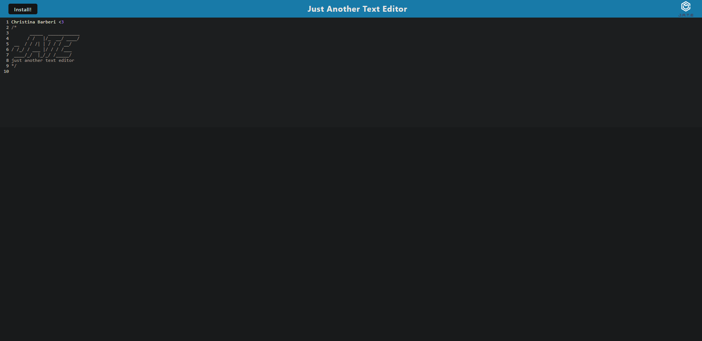

# PWA Text Editor

## Description

This is a basic text editing tool that can be accessed without an internet connection. It's designed as a Progressive Web App (PWA) and can be installed on your device. The application utilizes IndexedDB to save data locally, webpack to bundle files, and service workers to store files in cache for offline access.

## Table of Contents

* [Installation](#installation)
* [Usage](#usage)
* [Screenshot](#screenshot)
* [License](#license)
* [Questions](#Questions)
* [Email](#Email)
* [Github](#Github)

## Installation

This application uses Node.js and various npm packages. You'll need to install Node.js and then run ```npm i``` in the terminal at the root of the directory to install all dependencies

## Usage

After installing all the required dependencies you may run ```np run start``` in the terminal at the root of the directory to launch the application! You can access the app on localhost:3000 in your browser of choice. You can also install the application by clicking ths install button in the address bar.

## Screenshot:


## License
This project is licensed under the MIT license. Click [here](https://opensource.org/licenses/MIT) for more information.<br>


## Questions and Email

If you have any questions please feel free to reach out to my email christina.e.c.barberi@gmail.com

## Github

[GitHub](https://github.com/Christinaecb)